# File Explorer Wireframes

## Main Interface Layout

```mermaid
flowchart TD
    A[Header Bar] --> B[Toolbar]
    B --> C[File Explorer View]
    C --> D[Properties Panel]
    
    subgraph Header Bar
        H1[🗂️ File Explorer]
        H2[+ New View]
        H3[⚙️ Settings]
    end
    
    subgraph Toolbar
        T1[📁 New Folder]
        T2[📄 New File] 
        T3[🗑️ Remove]
        T4[🔍 Search]
        T5[📊 Example Data]
    end
    
    subgraph File Explorer View
        F1[📂 Root]
        F2[├── 📁 Documents]
        F3[├── 📁 Images] 
        F4[├── 📄 readme.txt]
        F5[└── 🏙️ london.city]
    end
    
    subgraph Properties Panel
        P1[Selected Item Info]
        P2[Name: Documents]
        P3[Type: Folder]
        P4[Size: 2.5 MB]
        P5[Modified: Oct 3, 2025]
    end
```

## Core Functionality Wireframes

### 1. File Selection State

### 2. Directory Expansion/Collapse

```mermaid
flowchart LR
    A[📁 Documents ▶️] -->|Click Expand| B[📁 Documents ▼️<br/>├── 📄 file1.txt<br/>├── 📄 file2.pdf<br/>└── 📁 Subfolder ▶️]
    B -->|Click Collapse| A
    
    B -->|Click Subfolder Expand| C[📁 Documents ▼️<br/>├── 📄 file1.txt<br/>├── 📄 file2.pdf<br/>└── 📁 Subfolder ▼️<br/>&nbsp;&nbsp;&nbsp;&nbsp;├── 📄 nested1.txt<br/>&nbsp;&nbsp;&nbsp;&nbsp;└── 📄 nested2.jpg]
```

### 3. Create New File/Directory Flow

## Search Functionality Wireframe

```mermaid
flowchart TD
    A[Search Bar] --> B[🔍 Search Button]
    A --> C[☑️ Restrict to Subtree]
    
    B --> D{Search Scope}
    D -->|Global| E[Search Entire File System]
    D -->|Restricted| F[Search Selected Directory Only]
    
    E --> G[Display All Matching Results]
    F --> H[Display Filtered Results]
    
    G --> I[Results List with Full Paths]
    H --> I
    
    subgraph Search Results
        I --> J[📄 document.txt - /root/docs/]
        I --> K[📄 document.pdf - /root/backup/]
        I --> L[📁 document_folder - /root/projects/]
    end
```

## Multiple Views Layout

```mermaid
flowchart TD
    A[Browser Window] --> B[View Tabs]
    B --> C[View 1: Explorer A]
    B --> D[View 2: Explorer B]
    
    subgraph View 1: Explorer A
        E[📁 /home/user]
        F[├── 📁 Documents]
        G[├── 📁 Pictures]
        H[└── 📄 notes.txt]
    end
    
    subgraph View 2: Explorer B  
        I[📁 /projects]
        J[├── 📁 web-app]
        K[├── 📁 mobile-app]
        L[└── 📄 README.md]
    end
    
    subgraph Drag & Drop Between Views
        M[📄 File from View 1] -.->|Drag & Drop| N[📁 Folder in View 2]
    end
```

## Mobile Responsive Design

## Multi-Select and Actions

## Weather API Integration (.city files)

## Error Handling States

```mermaid
flowchart TD
    A[User Action] --> B{Validation Check}
    B -->|Valid| C[Execute Action]
    B -->|Invalid| D[Show Error Message]
    
    D --> E[Error Types]
    E --> F[📛 Invalid File Name]
    E --> G[📛 No Parent Selected]
    E --> H[📛 Permission Denied]
    E --> I[📛 Network Error]
    
    F --> J[Red Border on Input Field]
    G --> K[Highlight Directory Selection]
    H --> L[Show Permission Dialog]
    I --> M[Retry Button]
    
    J --> N[Allow User to Correct]
    K --> N
    L --> N
    M --> N
    
    N --> A
```

## File Type Icons Mapping

```mermaid
flowchart LR
    A[File Extension Detection] --> B{Extension Type}
    
    B -->|.txt, .md| C[📄 Text Icon]
    B -->|.jpg, .png, .gif| D[🖼️ Image Icon]
    B -->|.pdf| E[📋 PDF Icon]
    B -->|.js, .ts, .html| F[💻 Code Icon]
    B -->|.mp3, .wav| G[🎵 Audio Icon]
    B -->|.mp4, .avi| H[🎬 Video Icon]
    B -->|.zip, .rar| I[📦 Archive Icon]
    B -->|.city| J[🏙️ City Icon]
    B -->|folder| K[📁 Folder Icon]
    B -->|unknown| L[📄 Generic Icon]
```

