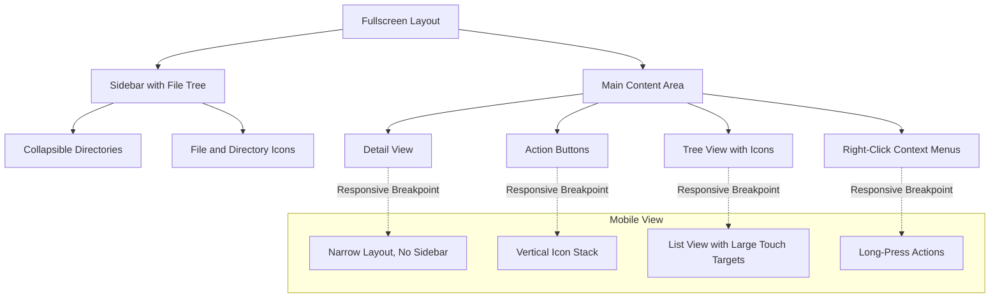

# Task Planning for File Browser Application

## Product requirements

### Core requirements

1. ✅ Select a file/directory: Clicking on a file or directory “selects” it (useful for other operations, below).
1. ✅ Create a new file/directory: The current selected directory is the parent and the user should be required to name the new file/directory.
1. ✅ Expand a directory: Clicking on a directory’s “Expand” button should reveal all the files and directories contained inside. Clicking again should “collapse” the view.
1. ✅ Remove a file/directory: Remove the selected file or directory.
1. ✅ Example button: Create 10K files/directories (there should be some nested element). This will be used during the demo.

### Recommended Extensions - complete at least 1

1. ✅ Move a file/directory: Move an existing file or directory into another directory. It can happen using drag and drop for example.
1. ✅ Find a file/directory: Given a filename, find all the files and directories that have exactly that name.
1. ✅ Restrict to a subtree: restrict the search to the selected directory
1. ✅ Files have the correct icon: Every known file extension will have an associated icon.
1. ✅ Drill down / roll up view: Make the selected directory the root in the current view and going back
1. ✅ Multiple views: Users may create additional “views” of the same file system (in the same browser window). Users may independently browse in each view. Users may use drag and drop between views.
1. Download weather for a city specified in the file name: The file is going to be the name of the city that we want to know the weather for (with “.city” extension). For example “london.city” should initiate a download of the weather json file for that city. You can use the api https://openweathermap.org/current.
1. Responsive design: Your frontend works just as well on small-screen formats (i.e. mobile) as it does on a full-sized screen (i.e laptop browser).
1. ✅ Multiselect: Users may select multiple files / directories (i.e shift-select). Extend existing functions (e.g remove) to support multi-select.
1. ✅ File/directory info: Selecting a file/directory displays useful information about the selected item.

### Personal extensions

1. ✅ List virtualization: Implement list virtualization techniques to ensure smooth scrolling and interaction of 10k items
1. ✅ Breadcrumbs
1. ✅ Expand/Collapse all
1. ✅ Navigation history (navigate back)
1. ✅ Move files with drag-and-drop into a breadcrumb
1. ✅ Show move progress (generator function)
1. Resolve move conflicts (skip/replace/cancel) using a generator function
1. Move files with toolbar button -> utilize a directory picker/navigator in a dialog so user can move across many levels quickly
1. Column info view
1. Column sorting

## User Stories

Use these stories to build Playwright test automation.

| Priority | Story ID | Given                                                          | When                                                                       | Then                                                                                             |
| -------- | -------- | -------------------------------------------------------------- | -------------------------------------------------------------------------- | ------------------------------------------------------------------------------------------------ |
| P1       | US-01    | I am viewing the file explorer interface                       | I click on a file or directory                                             | The file or directory becomes selected (highlighted) for future operations                       |
| P1       | US-02    | I have selected a directory in the file explorer               | I click the "Create New File" button and enter a valid filename            | A new file is created inside the selected directory with the specified name                      |
| P1       | US-03    | I have selected a directory in the file explorer               | I click the "Create New Directory" button and enter a valid directory name | A new directory is created inside the selected directory with the specified name                 |
| P1       | US-04    | I am viewing a collapsed directory in the file explorer        | I click on the directory's "Expand" button                                 | The directory expands to show all files and subdirectories contained within it                   |
| P1       | US-05    | I am viewing an expanded directory in the file explorer        | I click on the directory's "Collapse" button                               | The directory collapses to hide its contents                                                     |
| P1       | US-06    | I have selected a file in the file explorer                    | I click the "Remove" button and confirm the action                         | The selected file is permanently deleted from the file system                                    |
| P1       | US-07    | I have selected a directory in the file explorer               | I click the "Remove" button and confirm the action                         | The selected directory and all its contents are permanently deleted from the file system         |
| P1       | US-08    | I want to test the application with a large dataset            | I click the "Example" button                                               | The system creates 10,000 files and directories with nested structure for demonstration purposes |
| P1       | US-22    | I attempt to create a file with an invalid name                | I submit the file creation form with empty or illegal characters           | The system displays an error message and prevents file creation                                  |
| P1       | US-23    | I have not selected any directory                              | I click "Create New File" or "Create New Directory"                        | The system prompts me to select a parent directory first                                         |
| P1       | US-24    | I have not selected any file or directory                      | I click "Remove"                                                           | The system displays a message indicating no item is selected for removal                         |
| P2       | US-09    | I have selected a file or directory and I want to move it      | I drag the selected item and drop it onto a target directory               | The file or directory is moved into the target directory                                         |
| P2       | US-10    | I want to find files with a specific name                      | I enter a filename in the search box and click "Find"                      | The system displays all files and directories with exactly that name                             |
| P2       | US-11    | I have selected a directory and want to search within it       | I check "Restrict to subtree" and perform a search                         | The search results are limited to files within the selected directory and its subdirectories     |
| P2       | US-12    | I am viewing files with different extensions                   | I look at the file list                                                    | Each file displays the appropriate icon based on its file extension                              |
| P2       | US-13    | I have selected a directory and want to focus on it            | I double click a directory                                                 | The selected directory becomes the new root view, hiding parent directories                      |
| P2       | US-14    | I am in a drilled-down view and want to go back                | I click "Roll up" or navigate up                                           | The view returns to show the parent directory structure                                          |
| P2       | US-15    | I want to work with multiple file explorer views               | I click "Create New View"                                                  | A new independent file explorer view opens in the same browser window                            |
| P2       | US-16    | I have multiple views open and want to move files between them | I drag a file from one view and drop it into another view                  | The file is moved to the target location in the destination view                                 |
| P2       | US-17    | I have a file with a ".city" extension (e.g., "london.city")   | I double-click or select "Download Weather" on the city file               | The system downloads current weather data for that city as a JSON file using OpenWeatherMap API  |
| P2       | US-18    | I am using the application on a mobile device                  | I access the file explorer on my phone or tablet                           | The interface adapts to the smaller screen size while maintaining full functionality             |
| P2       | US-19    | I want to select multiple files at once                        | I hold Shift and click on multiple files or directories                    | Multiple items become selected simultaneously                                                    |
| P2       | US-20    | I have multiple files selected                                 | I click "Remove" with multiple items selected                              | All selected files and directories are deleted after confirmation                                |
| P2       | US-21    | I have selected a file or directory                            | I view the selection                                                       | Detailed information about the selected item is displayed (size, date modified, type, etc.)      |

### Technical requirements: data structures

- FileNode: interface representing a file or directory with properties like id, name, type, path, parentPath, level, size, created, modified, and optional extension.
- DirectoryStructure: object mapping directory paths to FileNode objects for quick lookup.
- FileSystem: structure containing arrays of files and directories, total item count, and a DirectoryStructure for efficient access. Contains methods for manipulating the file system (create, remove, move, search). Extends EventTarget to notify view of changes, and view can subscribe to changes in certain directories (stretch goal).

### Technical requirements: algorithms

- File/Directory Creation: Function to create new FileNode objects and insert them into the FileSystem at the correct location.
- Expansion/Collapse: Toggle function to change the expanded state of directories and update the view accordingly.
- Removal: Recursive function to delete a FileNode and all its children from the FileSystem.
- Move: Drag-and-drop handler to change the parentPath of a FileNode and update its position in the FileSystem.
- Search: Function to traverse the FileSystem and return all FileNodes matching a given name, with optional subtree restriction.
- Weather API Integration: Function to detect .city files, extract the city name, call the OpenWeatherMap API, and handle the response to download the weather data as a JSON file.
- Responsive Design: CSS media queries and JavaScript event listeners to adjust the layout and functionality based on screen size.
- Multi-Select: State management to track multiple selected FileNodes and update the UI accordingly.
- File/Directory Info Display: Function to retrieve and display detailed information about the selected FileNode.

### Technical requirements: performance

- Efficient Data Structures: Use of maps/objects for O(1) access to FileNodes by path.
- Lazy Loading: Only render visible parts of the file tree to improve performance with large datasets.
- Debounced Search: Implement debouncing for search input to reduce the number of search operations.
- Optimized Rendering: Use React's key prop and memoization to minimize unnecessary re-renders.
- Asynchronous Operations: Use async/await for API calls and long-running operations to keep the UI responsive.
- Profiling and Optimization: Regularly profile the application to identify and optimize performance bottlenecks.

### Technical requirements: testing

- Unit Tests: Write unit tests for all core functions (create, remove, move, search, API integration).
- Integration Tests: Test the interaction between components and the overall file system functionality.
- Performance Tests: Measure the time taken for operations on large datasets (e.g., 10,000 files).
- Responsive Tests: Verify the UI adapts correctly to different screen sizes and orientations.
- User Acceptance Tests: Conduct tests with real users to ensure the application meets usability and functionality requirements.
